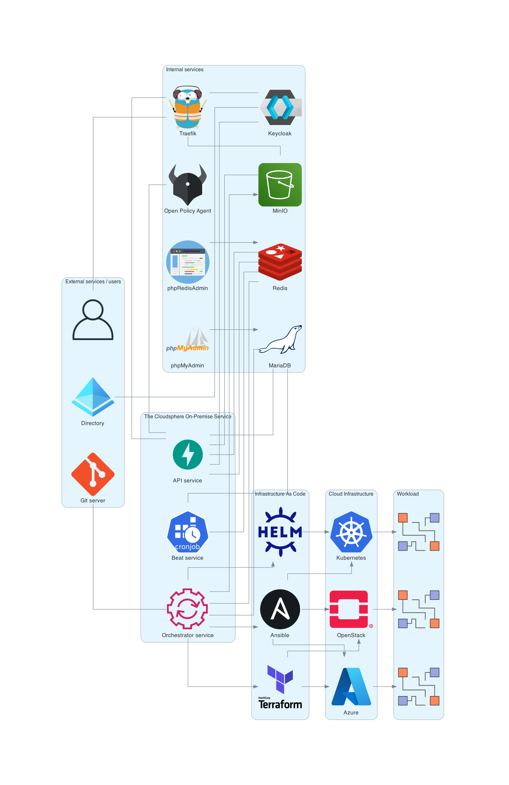

# The Cloudsphere as on-premise service

This section describes how The Cloudsphere can be operated as an on-premise service.

## Overview



## Prerequisites

A service account is required to access harbor.services.osism.tech in order
to download the necessary container image of the Enterprise Edition of The
Cloudsphere.

## Requirements

To use The Cloudsphere on-premise service, a virtual instance with the following
parameters is required.

* 8 vCPUs
* 32 GByte memory
* 100 GByte storage

DNS entries on the publicly accessible IP address of the virtual system are required
for access to the individual services. The following DNS entries are used by default.

* api.demo.thecloudsphere.io
* minio.demo.thecloudsphere.io
* keycloak.demo.thecloudsphere.io

TLS certificates are also required for these DNS entries. Self-signed certificates
are possible.

Access to all services is via port 443/TCP (HTTPS).

## Preparations

Docker and the Docker Compose Plugin for Docker must be installed and usable on the
virtual system in a current version.

The installation of this is documented on docs.docker.com.

* https://docs.docker.com/engine/install/
* https://docs.docker.com/compose/install/linux/

## Development environment

```
git clone https://github.com/thecloudsphere/service
cd service
```

In the ``.env`` file in this repository, various parameters must be customised
to the local conditions.

| parameter                                | default value                                     | description |
| :----------------------------------------| :-------------------------------------------------| :---------- |
| ``TCS_DATABASE_PASSWORD``                | ``password``                                      |             |
| ``TCS_DATABASE_ROOT_PASSWORD``           | ``password``                                      |             |
| ``TCS_DOMAIN_API``                       | ``api.demo.thecloudsphere.io``                    |             |
| ``TCS_DOMAIN_KEYCLOAK``                  | ``keycloak.demo.thecloudsphere.io``               |             |
| ``TCS_DOMAIN_MINIO``                     | ``minio.demo.thecloudsphere.io``                  |             |
| ``TCS_IMAGE``                            | ``harbor.services.osism.tech/tcs/tcs:latest``     |             |
| ``TCS_IMAGE_KEYCLOAK``                   | ``quay.io/keycloak/keycloak:20.0``                |             |
| ``TCS_IMAGE_MARIADB``                    | ``mariadb``                                       |             |
| ``TCS_IMAGE_MINIO``                      | ``minio/minio``                                   |             |
| ``TCS_IMAGE_OPA``                        | ``openpolicyagent/opa:edge-rootless``             |             |
| ``TCS_IMAGE_PHPMYADMIN``                 | ``phpmyadmin/phpmyadmin``                         |             |
| ``TCS_IMAGE_PHPREDISADMIN``              | ``erikdubbelboer/phpredisadmin``                  |             |
| ``TCS_IMAGE_RABBITMQ``                   | ``rabbitmq``                                      |             |
| ``TCS_IMAGE_REDIS``                      | ``redis``                                         |             |
| ``TCS_IMAGE_TRAEFIK``                    | ``traefik``                                       |             |
| ``TCS_KEYCLOAK_ADMIN_PASSWORD``          | ``password``                                      |             |
| ``TCS_LISTEN_ADDRESS``                   | ``0.0.0.0``                                       |             |
| ``TCS_LISTEN_ADDRESS_INTERNAL_SERVICES`` | ``0.0.0.0``                                       |             |

```
docker compose up -d
```
